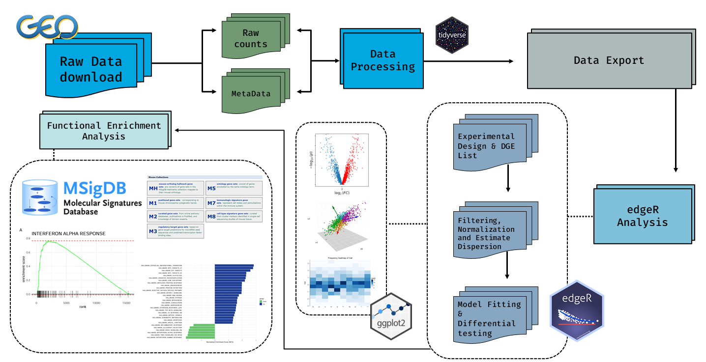

# Comparative Transcriptomic Analysis of Intact, Injury Non-Neuronal Cells  and Lesion-Derived Reactive Cultures
This repository contains a pipeline workflow for analyzing **bulk RNA-Seq** data from **lesion-derived reactive cultures (RCs) and injured and intact non-neuronal cells isolated from adult mouse cortex** 

The analysis was based on RNA-Seq data obtained from **Gene Expression Omnibus (GEO)**: 
https://www.ncbi.nlm.nih.gov/geo/query/acc.cgi?acc=GSE330004

This project focuses on **RNA-Seq differential expression and functional pathway enrichment analyses** to identify **differentially expressed genes** and characterize associated **biological pathways**

---

## Project Overview
- Import and prepare **RNA-Seq** **count matrix** and **metadata**
- Differential expression analysis using **edgeR**
- Visualization of DEGs using **MA, Volcano plots and Heatmaps**
- Dimensionality reduction using **(PCA)** for clustering the samples according to their experimental conditions
- Prepare the **MSigDB Hallmark gene sets and pathways**
- functional enrichment analysis using **fgsea** 

### Samples
|   Group   |       Details     |
|-----------|-------------------|
|`Vivo_IB`  |Injured non-neuronal cells|
|`Vivo_UB`  |Intact non-neuronal cells|
|`Vitro_RC` |Lesion-Derived Reactive Cultures|


### Key Comparisons
|Comparison|Biological Question|
|-----------|-------------------|
|`Injured Cortex vs. Uninjured Cortex`|What transcriptional changes are associated with cortical injury? |
|`Reactive Culture vs. Injured Cortex`|Do **Cultured RCs** resemble the **Injury State**?|
|`Reactive Culture vs. Uninjured Cortex`|How do the **Cultured RCs** differ from the **Intact State**?|

---
## Workflow Abstract



---
## Repository Structure
```
mouse-cortex-transcriptomics-analysis/
├── Data/
|   ├── Counts.csv
|   ├── MetaData.csv
|   └── GSE330004_raw_counts.csv
├── Scripts/
|   ├── 01_Data_Processing.R
|   ├── 02_edgeR.R
|   ├── 03_DEG_Visualizations.R
|   └── 04_fgsea_Enrichment_Analysis.R
├── Results/
|   ├── Tables/
|   |   ├── LogCPM.csv
|   |   ├── edgeR_results_IB_vs_UB.csv
|   |   ├── edgeR_results_RC_vs_IB.csv
|   |   └── edgeR_results_RC_vs_UB.csv
|   ├── Figures/
|   └── FGSEA/
|
|
└── README.md
```
---

## Requirements 
### R
```
R version >= 4.6.1
```

### Bioconductor Packages
```
install.packages("BiocManager")
BiocManager::install(
  c("GEOquery", "edgeR", "org.Mm.eg.db", "fgsea", "ComplexHeatmap")
)
```
### CRAN Packages
```
install.packages(
  c("tidyverse", "ggrepel", "circlize", 
  "RColorBrewer", "patchwork", "msigdbr")
)
```
---
## Disclaimer
This repository is intended for educational and portfolio project purposes, based on publicly available RNA-Seq data from the cited study. The results reflect an independent downstream analysis and should not be considered original findings from the study
